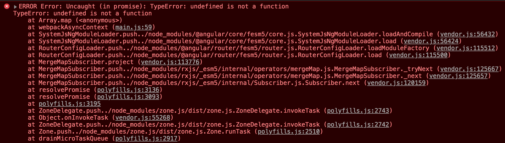

# TIL-20190812/Angular: Lazy loading feature modules

Angular의 라우팅은 비동기 방식을 지원한다. 이 방식을 Lazy loading 이라고 부르며, NgModule을 분리해서 사용자 요청(해당 경로)이 들어왔을 때 모듈을 불러오는 기능이다.

즉, 컴파일 단계에서 나중에 사용할 모듈을 메인 모듈에서 분리하기 때문에 초기 로딩 시간을 줄일 수 있다. 

## 소소한 팁

처음부터 Lazy loading을 고려하지 않고 라우터를 설정 했다가 나중에 적용할 때 다음과 같은 에러가 발생할 수 있다.

굉장히 난해한 오류이고 다양한 원인이 있을 수 있겠지만...
Lazy loading 할 모듈을 `app.module.ts` 파일 `imports` 배열에 그대로 남겨둔 경우에 발생 할 수 있다.

따라서 Lazy loading 대상이 되는 모듈은 App 레벨 모듈에서 Import 하지 않도록 주의해야 한다.
